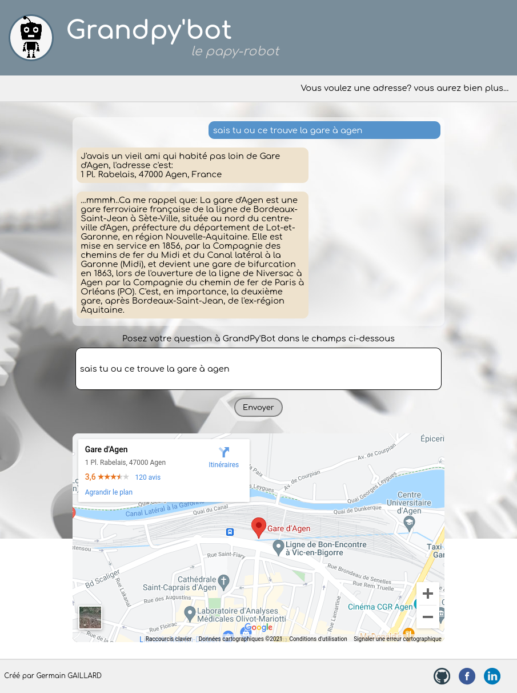

# GrandPy'bot
GrandPy'bot is the result of my project 7 as part of my Open Classrooms training as a Python developer.
It's a web application that allows a user to enter a question regarding the location of a place, it will return an address, a map, and some additional information relating to his request. (at this time, only the French language is available.)

## Programming Languages
- python
- HTML5 CSS3
- JavaScript Jquery
## Modules

All dependencies are listed in requirements.txt
## Tests
Using Pytest
there are 2 tests functions:
- test_answer: will test the dict send to Ajax (mocking responses from APIs).
- test_parser: will test the parsing of the user's entry.
## Heroku
You can try GrandPy'bot at this address: https://sp-grandpybot.herokuapp.com/
## Localhost
To launch GrandPy'bot from localhost: In your virtual env, simply launch **run.py** and open your web browser at http://127.0.0.1:5000/.
## Sources
This app uses APIs from Google and Wiki Media.
And it has been developed with Flask framework.
## Contacts
- my e-mail: gaillard.germain@gmail.com
- my Github: https://github.com/screw-pack
- my linkedIn: https://www.linkedin.com/in/gaillard-germain-2301861b4/
